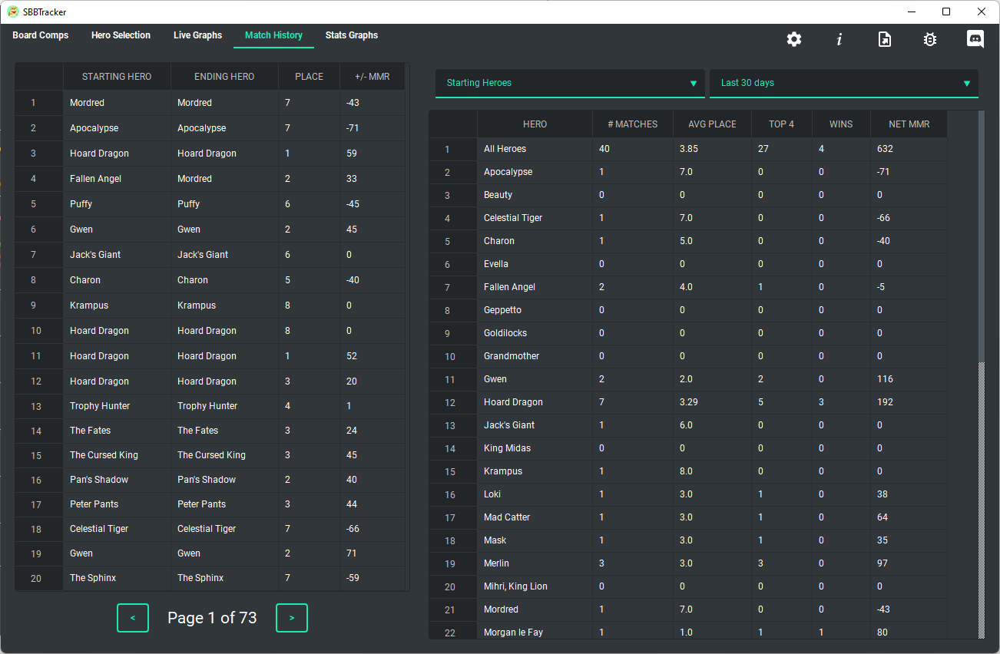
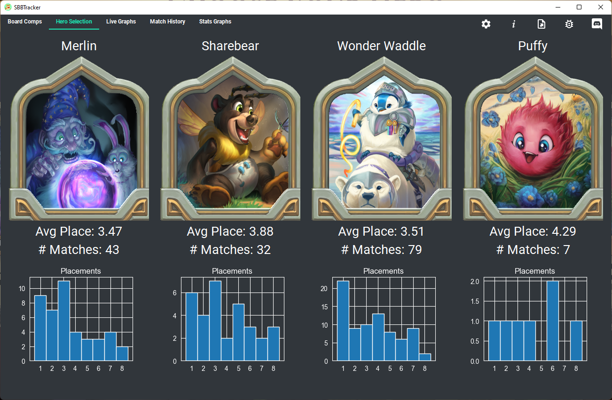

# SBBTracker 
A game tracker for storybook brawl

Join the SBBTracker Discord: 

## Troubleshooting
See the [FAQ](https://github.com/SBBTracker/SBBTracker/wiki/FAQ) first if you have any issues.
If FAQ doesn't help you, consider creating an issue or posting in the #bugs channel on Discord.

## Features
* Keep track of previous opponent's boards
* Game overlay w/ Simulation
* See history of players' healths
* Record game placements
* Stat analysis of your results
* Export your stats to csv

Get the installer for the latest release [here](https://github.com/SBBTracker/SBBTracker/releases/latest)

## Building from Source
Instructions for building from source coming soon
